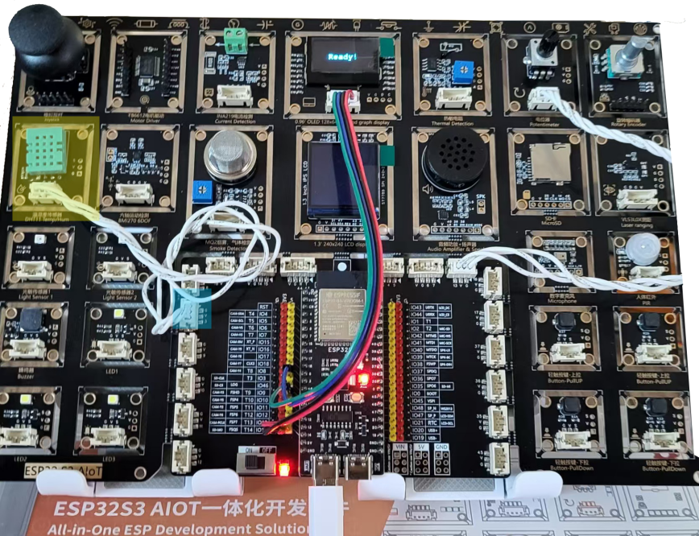
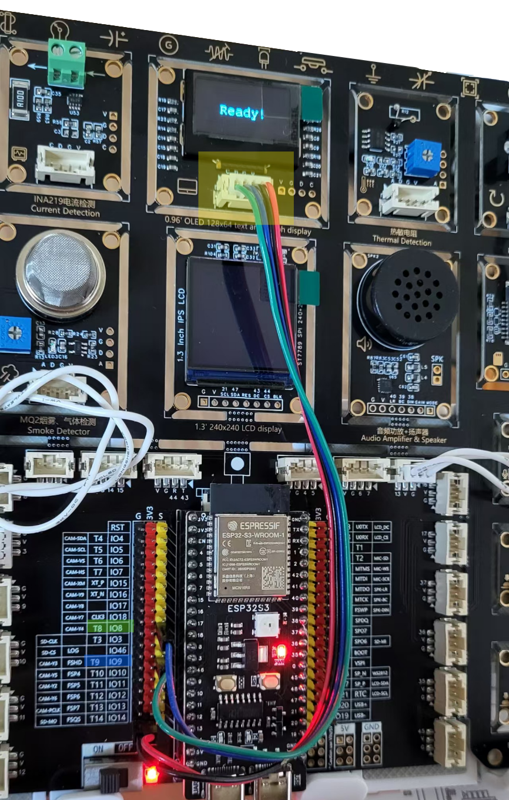
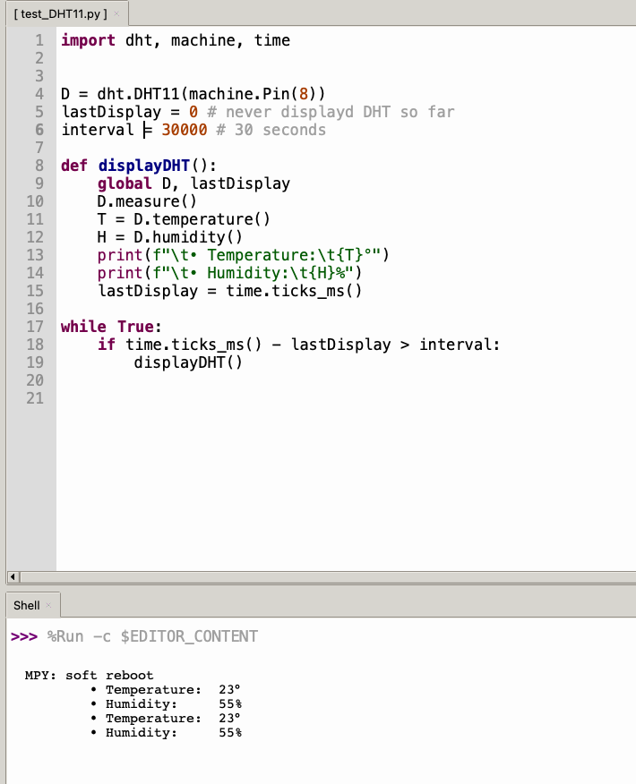

# LESSON 01: DHT

## Installation

The DHT11/22 sensors are the most basic, *Hello World*-like sensors in the IoT arsenal. They provide vaguely accurate temperature and humidity data. They are usually easy to use (as the gritty details are hidden behind a library), and provide instant gratification for the learner.

The DHT11 is usually blue, whereas the DHT22 normally comes in white. You can see on the board that we have a DHT11. Connect it with a 3-pin "Boson" cable to Pin 3, the 2nd connector on the left from the top. I was tempted – like you probably are right now – to connect it to the first one, Pin 8: but that pin is already in use for I2C, which we will use shoertly, for the OLED display.



While we're at it, you can connect the OLED, with a Boson-to-Dupont cable; from left to right, looking at the Boson connector:

* C: SCL, Pin 9 (Green on the photo)
* D: SDA, Pin 8 (Blue on the photo)
* G: GND, one of the many GND pins (Black on the photo)
* V: VCC, one of the many 3.3 V pins (Red on the photo)



## Dive in

This lesson is divided into 3 steps. [Part a](https://github.com/Kongduino/ESP32_Educ/blob/master/Lesson_01/01_a_DHT11.py) teaches you the basics of reading data from the DHT11 and display it in the REPL on a regular basis, here 30 seconds.

### Part A

```python
import dht, machine, time

D = dht.DHT11(machine.Pin(8))
lastDisplay = 0 # never displayd DHT so far
interval = 30000 # 30 seconds

def displayDHT():
    global D, lastDisplay
    D.measure()
    T = D.temperature()
    H = D.humidity()
    print(f"\t• Temperature:\t{T}°")
    print(f"\t• Humidity:\t{H}%")
    lastDisplay = time.ticks_ms()

while True:
    if time.ticks_ms() - lastDisplay > interval:
        displayDHT()
```

There's already a DHT library in MicroPython, so we don't need to install anything, just `import dht` amd create a DHT object, which we will call `D`. We set up an interval to 30,000 milliseconds, and a `lastDisplay` semaphore to 0, ie never used so far.

In a `while True` loop (which means it never fails, ie runs forever), we check the elapsed time in milliseconds, and compare it with the lastDisplay record: `time.ticks_ms() - lastDisplay`. If it's more than 30 seconds, we print data in the REPL, and update `lastDisplay`. If not, we just skip over.

This gives you much more control on the execution of the loop than using `time.sleep(30)`, which blocks the execution of other code: with `sleep()` MicroPython cannot do anything else, it has to wait it out. Whereas with this "trick" of checking intervals, you can decide to do something else in-between.

The `displayDHT()` function reads DHT data, and prints it out. Having a function here isn't necessary, as we only use it in one place, but it is good practice – it keeps the code cleaner, and easier to read.

The `global` keyword here tells Python that we will be using **existing** global variables, `D` and `lastDisplay` – without this new variables, local to `displayDHT()` would be created, which would lead to errors.

The way the DHT11 works is, you ask it first to take measurements: it does not do this automatically, but needs to be prompted. Then you can read the current temperature and humidity. And display it in the REPL.

A word about `print(f"...")`. The `f` here is important: it allows Python to format the output with variables, which are quoted between curly brackets. Thus:

```python
print(f"\t• Temperature:\t{T}°")
```

Means that Python needs to replace `{T}` with the contents of the variable T. This makes the code much easier to read.

Press the RUN button (the green arrow) and the code should start displaying Temperature and Humidity right away.



### Part B

We will now upgrade our code to display the data on the small OLED screen. These are very common, and cheap. And very easy to use. They're usually called something along the lines of SSD1306, and can vary in size, although 128 x 64 pixels is the most common. There is of course a library for this – it's in the `lib` folder, where all the extra libraries are stored.

So the main difference between the previous part and [this one](https://github.com/Kongduino/ESP32_Educ/blob/master/Lesson_01/01_b_DHT11.py) is the addition of SSD1306-related code. The way to detect whether an I2C device is present is to scan the bus, and see whether the *expected* ID number is there – there is no official registry, so some devices may have the same ID while not being what you expect. But on this board it is not an issue. If you have a `0x3C` ID, it is the OLED...


```python
hasOLED = False

if devices.count(0x3c) == 0:
    print("No SSD1306!")
    sys.exit()
else:
    from ssd1306 import SSD1306_I2C
    from freesans9 import FreeSans9Defs
    display = SSD1306_I2C(128, 64, i2c)
    hasOLED = True
```

We add a variable called `hasOLED` and set it to false. It will be used in `displayDHT()` to decide whether to show the data on the OLED, or not. If we have the OLED, we set `hasOLED` to true, and import a font and the ssd1306 library. We can now initialize a `display` object that will control the OLED.

The rest of the code is similar. And as mentioned, the `displayDHT()` function checks whether we have an OLED plugged in, and if so, prints out the data on-screen:

```python
    if hasOLED:
        display.cls()
        display.displayString(FreeSans9Defs, f"DHT:", 44, 0)
        display.displayString(FreeSans9Defs, f"Temp: {T}C", 0, 20)
        display.displayString(FreeSans9Defs, f"RH:  {H}%", 0, 40)
        display.show(rotate180 = False)
```

This way, if the OLED is not plugged in, or not correctly, the code will still work like in Part A.