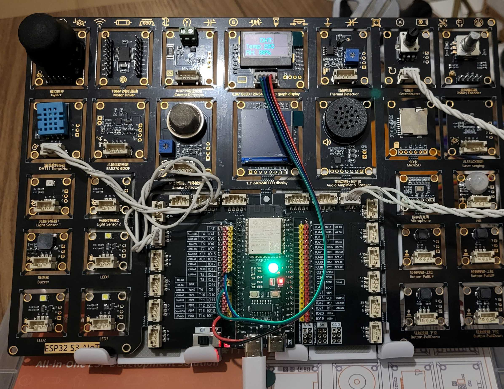
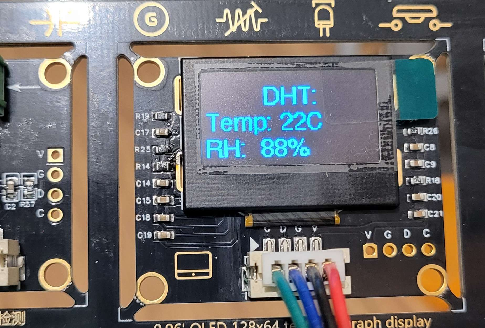

# Lesson 02: Neopixel!

## 02_a_RGB_LED

The ESP32 S3 board itself has a Neopixel: an RGB LED that can change its colour by setting values, 0 to 255, individually for the red, green and blue channels, hence the RGB name. It also can be chained: you will find on the market panels, rings, strips etc with any number of Neopixels. Each of which being addressable separately, allowing for pretty colorful effects.

But, we have only one. So let's try something fun with it. The board has a potentiometer, a stick-like know that you can turn left and right. It produces an analog value that can be converted to a 12-bit numeric value, from 0 to 4,095. We could map this value to an array of colour values, and change the colour of the Neopixel accordingly.

AI provided Python code to create a rainbow-style colour palette, from red to purple:

```python
#  Rainow Palette
import matplotlib.pyplot as plt
import numpy as np

# Get the 'turbo' colormap object
cmap = plt.get_cmap('turbo')

# Generate 256 colors from the colormap
# The result is a NumPy array of shape (256, 4) with RGBA float values between 0.0 and 1.0
turbo_colors_rgba = cmap(np.linspace(0, 1, 256))

# If you prefer 0-255 integer RGB values (without alpha channel):
#  turbo_colors_rgb256 = (turbo_colors_rgba[:, :3] * 255).astype(int)
```

Running this on a computer supplied a 256-colour palette that looked like this:

```python
print(turbo_colors_rgb256[:255])
[[ 48  18  59]
 [ 49  21  66]
 [ 50  24  74]
...
```

A little reformatting gave us proper Python code:

```python
Palette = [
    [48, 18, 59], [49, 21, 66], [50, 24, 74], [52, 27, 81],
    [53, 30, 88], [54, 33, 95], [55, 35, 101], [56, 38, 108],
...
    [132, 7, 1], [129, 6, 2], [125, 5, 2], [122, 4, 2]
]
```

So now all we need to do is to map the 4,096 possible values from the potentiometer to a number ranging from 0 to 255. Easy enough, since the 0-4,096 range is exactly 16 times bigger than 0-256. So we read that value and divide it by 16.

The potentiometer is managed by yet another library, included by default in MicroPython, ADC. I connected it to Pin 13. Not all pins are ADC-compatible, so I had to play around with options until I got one that worked.

```python
from machine import Pin, ADC

adc_pin = Pin(13, mode=Pin.IN)
adc = ADC(adc_pin)
adc.atten(ADC.ATTN_11DB)
```

The [documentation](https://docs.micropython.org/en/latest/esp32/quickref.html) says:

> To read voltages above the reference voltage, apply input attenuation with the `atten` keyword argument. Valid values (and approximate linear measurement ranges) are:

> ADC.ATTN_0DB: No attenuation (100mV - 950mV)
> ADC.ATTN_2_5DB: 2.5dB attenuation (100mV - 1250mV)
> ADC.ATTN_6DB: 6dB attenuation (150mV - 1750mV)
> ADC.ATTN_11DB: 11dB attenuation (150mV - 2450mV)

Voltage input attenuation is essentially the opposite of amplification: it reduces signal strength by a specific ratio, to scale it down for devices like ADCs, preventing clipping or damage. Basically it makes sure the ESP32 won't be damaged – which is why you can only use certain pins, connected to the ADC.

Reading from the ADC is easy: `now = int(adc.read() / 16)`. We make sure `now` is an integer value by surrounding the division with `int()`. This is because `now` will be used as the index to the Palette, are array indexes must be integers.

```python
def setColours(now):
    C = Palette[now] # Get colour data
    r = C[0] # assign data to each var
    g = C[1]
    b = C[2]
    print(f"Index = {now}, R = {r}, G = {g}, B = {b}")
    np[0] = (r, g, b)
    np.write()
```

The `setColours(now)` function takes the index, and retrieves the colour data, which is itself a 3-number array. It then assigns the r, g and b values, and assigns it to the Neopixel. Nothing happens yet: you need `np.write()` to actually provoke the change in colours.

### The use of ticks_ms()

You can see that in the code I am using `time.ticks_ms()` to decide whether to read the potentiometer. This is because reading too fast, repeatedly, would serve no purpose. A 100-ms, ie 0.1 second delay is good enough to slow things down, without making the process sluggish.

```python
    if time.ticks_ms() - lastRead > interval:
```

It is the same "trick" we were using in lesson 01 to decide whether to poll the DHT11 or not.

## 02_b_OLED

We can also use the potentiometer to set the contrast on the OLED. This is even easier.

```python
while True:
    if time.ticks_ms() - lastRead > interval:
        now = int(adc.read() / 16)
        if lastValue != now:
            display.contrast(now)
            print(f"Contrast: {now}")
            if now == 0:
                display.poweroff()
            else:
                display.poweron()
            lastValue = now
            lastRead = time.ticks_ms()
```

The `display.contrast(V)` sets the contrast to `V` (0 to 255), so this is the same process: read the value from the potentiometer and divide it by 16. And apply that. The only twist here is that if we reach `0` we want to turn the display off with `display.poweroff()`. Or turn it on if we go above, with `display.poweron()`.

## 02_c_RGB_LED_DHT11

Why now use the Neopixel to display a colour, depending on the ambien temperature? Blue if too cold, yellow if below comfortable, green if comfortable, orange if it starts to get sweaty, and red for where's the aircon? The core code will be deciding what stage we're at, with `if`, `elif` and `else`:

```python
    if T < 10:
        setColours(0, 0, 255) # Blue
    elif T < 18:
        setColours(255, 255, 143) # Yellow
    elif T < 26:
        setColours(0, 255, 0) # Green
    elif T < 33:
        setColours(255, 191, 0) # Orange
    else:
        setColours(255, 0, 0)
```

`setColours(255, 0, 0)` us a modified version of the previous code: it takes pre-determined r, g and b values, and effects the change. Very simple code:

```python
def setColours(r, g, b):
    np[0] = (r, g, b)
    np.write()
```

This is the result with an ambient temperature of 22°:




