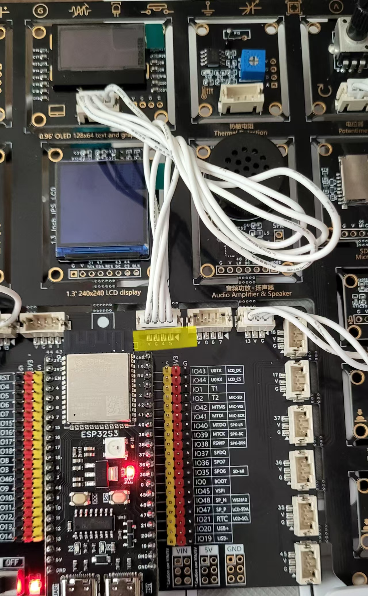

# Lesson 04: A Class Act!

We are going to learn about Python's classes. A `Class` is a reusable object that you can fit with functions and variables for easy re-use. We have played with classes already: the `display` object used in the OLED and MAX7219 libraries for example are classes.

Our code so far, when trying to assert whether the OLED is connected, scans the I2C bus, and looks for the ID `60`. Why do this every time, and for every I2C-based device, when we could do it once, and supply an object that has all the answers?

## Part A: A very basic `I2C_Scanner` class:


```python
class I2C_Scanner_v1():
    def __init__(self, i2c):
        self._hasOLED = False
        self._has6DOF = False
        self._hasTOF = False
        self._myI2C = i2c
        self._devices = self._myI2C.scan()
        if 60 in self._devices:
            self._hasOLED = True
        if 41 in self._devices:
            self._hasTOF = True
        if 104 in self._devices:
            self._has6DOF = True

    @property
    def hasOLED(self):
        return self._hasOLED

    @property
    def has6DOF(self):
        return self._has6DOF

    @property
    def hasTOF(self):
        return self._hasTOF
```

## Part B: So what if I want to check regularly?

Like, if I plug in later on a new device. The scanner wouldn't be aware of that, right? Indeed, my dear, it wouldn't be... So... We need to change the code, and add a `check()` function:

```python
class I2C_Scanner():
    def __init__(self, i2c):
        self._hasOLED = False
        self._has6DOF = False
        self._hasTOF = False
        self._myI2C = i2c
        self.check()

    def check(self):
        self._devices = self._myI2C.scan()
        if 60 in self._devices:
            self._hasOLED = True
        if 41 in self._devices:
            self._hasTOF = True
        if 104 in self._devices:
            self._has6DOF = True

    @property
    def hasOLED(self):
        return self._hasOLED

    @property
    def has6DOF(self):
        return self._has6DOF

    @property
    def hasTOF(self):
        return self._hasTOF
```

This way, you can check regularly, and update the variables inside the scanner. Here is the updated example, with bonus code, where it uses the display if it's present. Why not? :-)


```python
import machine, time
from I2C_Scanner_v2 import I2C_Scanner

i2c = machine.I2C(0, scl=5, sda=4, freq=400000, timeout=50000)
SC = I2C_Scanner(i2c)
lastDisplay = 0
interval = 30000 # 30 seconds
display = None

while True:
    if time.ticks_ms() - lastDisplay > interval:
        print("\n\nRunning Scanner!")
        dv = "Devices: "
        SC.check()
        if SC.hasOLED:
            print(" • OLED on!")
            dv += "OLED "
            if display == None:
                from ssd1306 import SSD1306_I2C
                from freesans9 import FreeSans9Defs
                display = SSD1306_I2C(128, 64, i2c)
            display.cls()
            display.displayString(FreeSans9Defs, "OLED on", 44, 0)
            display.show(rotate180 = False)
        else:
            print(" • No OLED found!")
        if SC.has6DOF:
            print(" • 6DOF on")
            dv += "6DOF "
        else:
            print(" • No 6DOF found!")
        if SC.hasTOF:
            print(" • TOF on")
            dv += "TOF "
        else:
            print(" • No TOF found!")
        print(dv)
        if display != None:
            display.displayString(FreeSans9Defs, dv, 0, 20, 1)
            display.show(rotate180 = False)
        lastDisplay = time.ticks_ms()

```

## Part C: Let's make it more flexible!

In v3, we're changing tacks a little: the init method builds a dictionary of I2C IDs, which we could later augment, and the `check()` function goes through the list, without knowing in advance what we are looking for. It makes adding more sensors much easier. The usual `hasXXX` properties have been replaced by one `hasDevice()` function/property. So the code in Part C has been adapted to use that oone property, passing an ID for each device we want to check on.

```python
class I2C_Scanner():
    def __init__(self, i2c):
        self._ID_OLED = 60
        self._ID_6DOF = 41
        self._ID_TOF = 104
        self._myI2C = i2c
        self._objects = {}
        self._objects[self._ID_OLED] = False
        self._objects[self._ID_6DOF] = False
        self._objects[self._ID_TOF] = False
        self.check()

    def check(self):
        self._devices = self._myI2C.scan()
        print(self._devices)
        for x in self._objects:
            print(f"Looking for {x}")
            if x in self._devices:
                self._objects[x] = True

    #@property
    # Since we are passing a parameter, it cannot be a property anymore.
    def hasDevice(self, ID):
        return self._objects[ID]
```

## Part D: Let's make it even more more flexible!

We're still working so far with a fixed set of devices. What if you wanted to decide, while creating an instance of the `I2C_Scanner` class, of which devices interest you? After all, you may have connected external sensors, and may not be interested in the default ones...

Here's v4, in all its simplified glory:

```Python
class I2C_Scanner():
    def __init__(self, i2c, objects):
        self._myI2C = i2c
        self._objects = objects
        self.check()

    def check(self):
        self._devices = self._myI2C.scan()
        print(self._devices)
        for x in self._objects:
            print(f"Looking for {x}")
            if x in self._devices:
                self._objects[x] = True

    #@property
    # Since we are passing a parameter, it cannot be a property anymore.
    def hasDevice(self, ID):
        return self._objects[ID]
```

The `__init__` function now takes 2 parameters, the `i2c` bus to inspect, and a `dict` of devices to look for. Instead of creating it on the fly, we delegate this to the user. Here's what it looks like:

```python
import machine, time
from I2C_Scanner_v4 import I2C_Scanner

i2c = machine.I2C(0, scl=5, sda=4, freq=400000, timeout=50000)
#################################
# What all are these numbers?!? #
# See Part D of the lesson      #
#################################


ID_OLED = 60
ID_6DOF = 41
ID_TOF = 104
objects = {}
objects[ID_OLED] = False
objects[ID_6DOF] = False
objects[ID_TOF] = False

SC = I2C_Scanner(i2c, objects)
lastDisplay = 0 # never displayd DHT so far
interval = 30000 # 30 seconds
display = None

while True:
    if time.ticks_ms() - lastDisplay > interval:
        print("\n\nRunning Scanner!")
        dv = "Devices: "
        SC.check()
        if SC.hasDevice(ID_OLED):
            print(" • OLED on!")
            dv += "OLED "
            if display == None:
                from ssd1306 import SSD1306_I2C
                from freesans9 import FreeSans9Defs
                display = SSD1306_I2C(128, 64, i2c)
            display.cls()
            display.displayString(FreeSans9Defs, "OLED on", 44, 0)
            display.show(rotate180 = False)
        else:
            print(" • No OLED found!")
        if SC.hasDevice(ID_6DOF):
            print(" • 6DOF on")
            dv += "6DOF "
        else:
            print(" • No 6DOF found!")
        if SC.hasDevice(ID_TOF):
            print(" • TOF on")
            dv += "TOF "
        else:
            print(" • No TOF found!")
        print(dv)
        if display != None:
            display.displayString(FreeSans9Defs, dv, 0, 20, 1)
            display.show(rotate180 = False)
        lastDisplay = time.ticks_ms()
```

The code is quasi identical to the previous version: we just create a dict of the values we want and pass this on. So we now have an `I2C_Scanner` that is flexible enough to accept any kind of I2C device, regardless of whether it's present on the board, or external.

We probably could improve on this, but for now we have a functional class that does the job!

### So, about these numbers???

```
>>> import machine
>>> i2c = machine.I2C(0)
>>> i2c
I2C(0, scl=9, sda=8, freq=400000, timeout=50000)
```

When you create an I2C object by default, you can have a look at its parameters: in this case, they are:

* The I2C bus number, 0
* The SCL pin, 9
* The SDA pin, 8
* The `freq`uency, ie the speed: 400 KHz
* the timeout, in ms: the time after which it will give up trying to connect.

In the example above, I do:

```python
i2c = machine.I2C(0, scl=5, sda=4, freq=400000, timeout=50000)
```

The only difference here is the SCL/SDA pins:



I connected the OLED to another set of pins, 4 and 5, and had to specify them when creating the `i2c` object, or else the code wouldn't have found the OLED, as it would have been on the wrong bus.
