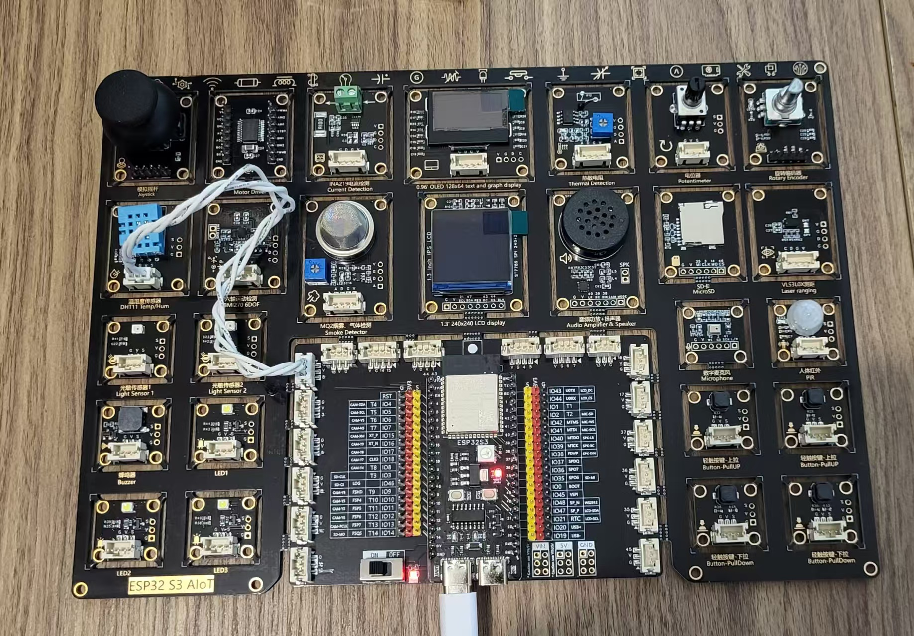
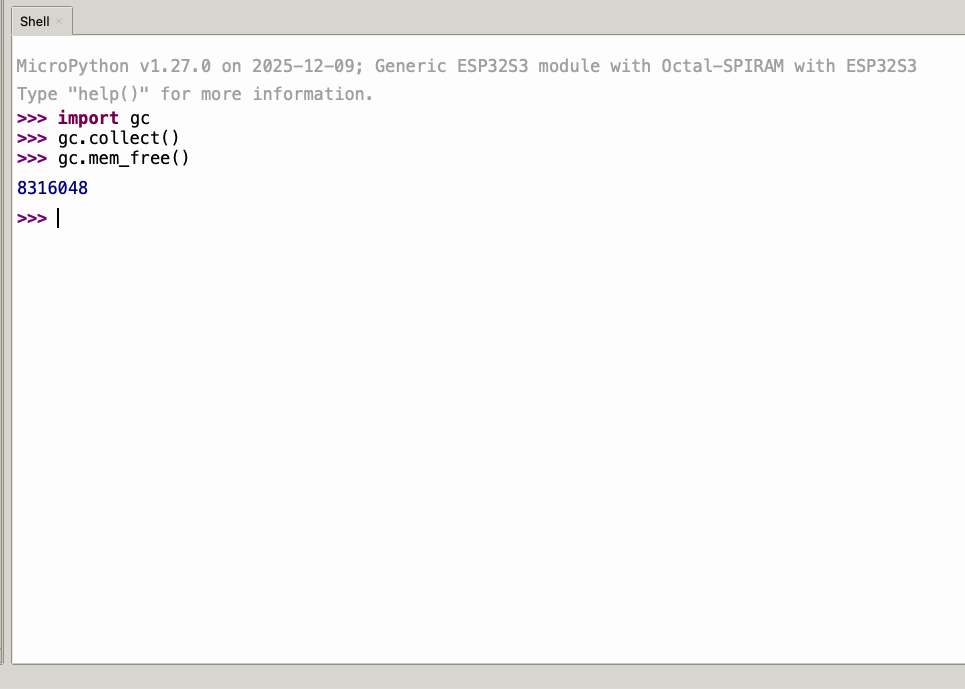

# ESP32_Educ

A progressive tutorial for the ESP32 S3 AIoT board, based on MicroPython.

## The Board

I found this board on Taobao, and ordered the cheaper version to try it out (the main difference I can see is the slightly more expensive one has a camera, hence the `AIoT` mention). I have been wanting to write such a tutorial, and this board looked like a perfect fit. I wasn't disappointed: while there are a few quirks, typos and the like, by and large this board is VERY well made, and deserves some love. So here goes.


*Ready for Lesson 01?*

### Installing MP

Head first to [MicroPython Downloads](https://micropython.org/download/ESP32_GENERIC_S3/) for the Generic ESP32 S3. That's the one sold with the board (if you buy a full set) – in its ESP32-S3-WROOM-1-N16R8 version: 16 MB  Flash, 384 kB ROM, 8 MB SRAM. You will want the Firmware version with support for Octal-SPIRAM: the latest as of today being [20251209-v1.27](https://micropython.org/resources/firmware/ESP32_GENERIC_S3-SPIRAM_OCT-20251209-v1.27.0.bin).

Next you will need [esptool](https://github.com/espressif/esptool). Which itself requires Python. Usually

```
pip install esptool
```

Should be enough to install esptool. Once you have that you can follow the [Installation instructions](https://micropython.org/download/ESP32_GENERIC_S3/). Basically:

```bash
cd ~/Downloads/ # or wherever you put the .bin file
esptool --port PORTNAME erase_flash
esptool.py --baud 460800 write_flash 0 ESP32_GENERIC_S3-SPIRAM_OCT-20251209-v1.27.0.bin
```

If nothing breaks, reset the device to reboot it and open [Thonny](https://thonny.org/). It's not a great IDE but it is easy to use and will come in handy for handling files in a visual way. Select the correct port and MicroPython (ESP32). Accept and click on the red button connect/disconnect. The following message should appear.



*If you're still with me, bravo, you have MP working! And it indeed has 8 MB of RAM. That's plenty!*

### Installing the tutorial

Git clone or download this repository. In Thonny's file browser, on the left, up top, navigate to this folder – it's a bit quirky to use but a few clicks should do the job. Once you have the files and folders in the list, select the Lessons, the `lib` folder, and the `boot.py` file. Click on the burger icon and select `Upload to`. It will take a while but everything will be copied onto the ESP32.


